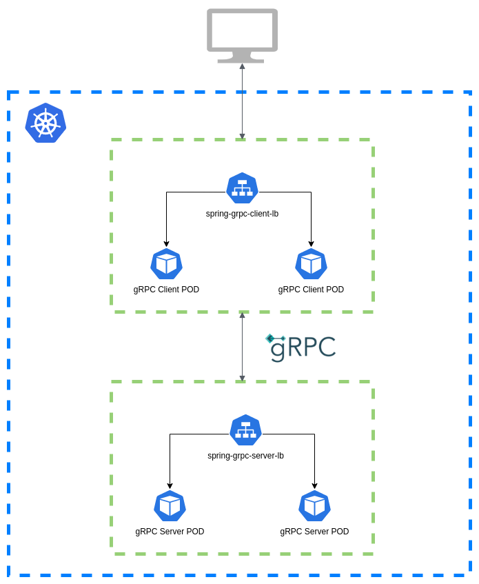
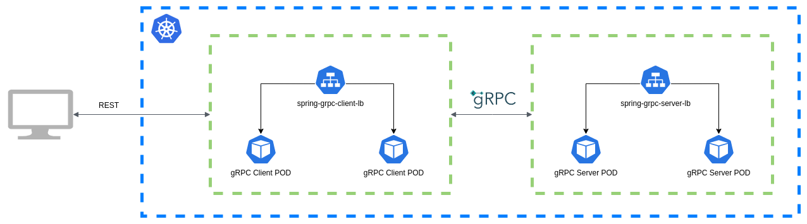

## Kubernetes Spring gRPC



### Requisitos para execução em ambiente local

 - [minikube](https://minikube.sigs.k8s.io/docs/)

### Como executar

Tenha certeza que o cluster k8s do minikube está em execução e com o contexto corretamente selecionado.

As imagens Docker das aplicações `simple-spring-grpc-client-app` e `simple-spring-grpc-server-app` estão disponíveis para uso no meu [repositório Docker](https://hub.docker.com/u/tonyals), mas caso queira consultar o código fonte acesse o repositório [spring-grpc-k8s-example-source-code](https://github.com/TonyALS/spring-grpc-k8s-example-source-code).

- 1º Execute `kubectl apply -f grpc-server-deployment.yaml` para subir os POD's da aplicação servidor;
- 2º Execute `kubectl apply -f grpc-client-deployment.yaml` para subir os POD's da aplicação cliente;
- 3º Execute `kubectl apply -f grpc-server-service.yaml` para subir o service com load balancer do servidor;
- 4º Execute `kubectl apply -f grpc-client-service.yaml` para subir o service com load balancer do client.
- 5º Após a inicialização das aplicações execute `minikube service spring-grpc-client-lb --url` e pegue a URL gerada.

Para conferir o status dos POD's execute `kubectl get pods`

### Fazendo a requisição via Postman

Para facilitar os testes, dois enpoints REST (`GET` e `POST`) foram disponibilizados. Utilize a URL gerada no passo 5 com o seguinte payload para criar uma nova pessoa:
```
{
    "name": "Any Name",
    "email": "a@a.com"
}
```
O fluxo da requisição acima será o seguinte:



Para buscar um pessoa criada basta adicionar o ID gerado e fazer uma chamada `GET /id` na URL anterior.

#### Observação
A aplicação servidora possui um banco H2 em memória, portanto, consistência de dados salvos não é um foco neste exemplo :).

#### Referências
[Documentação oficial do Spring gRPC](https://yidongnan.github.io/grpc-spring-boot-starter/en/kubernetes.html)
